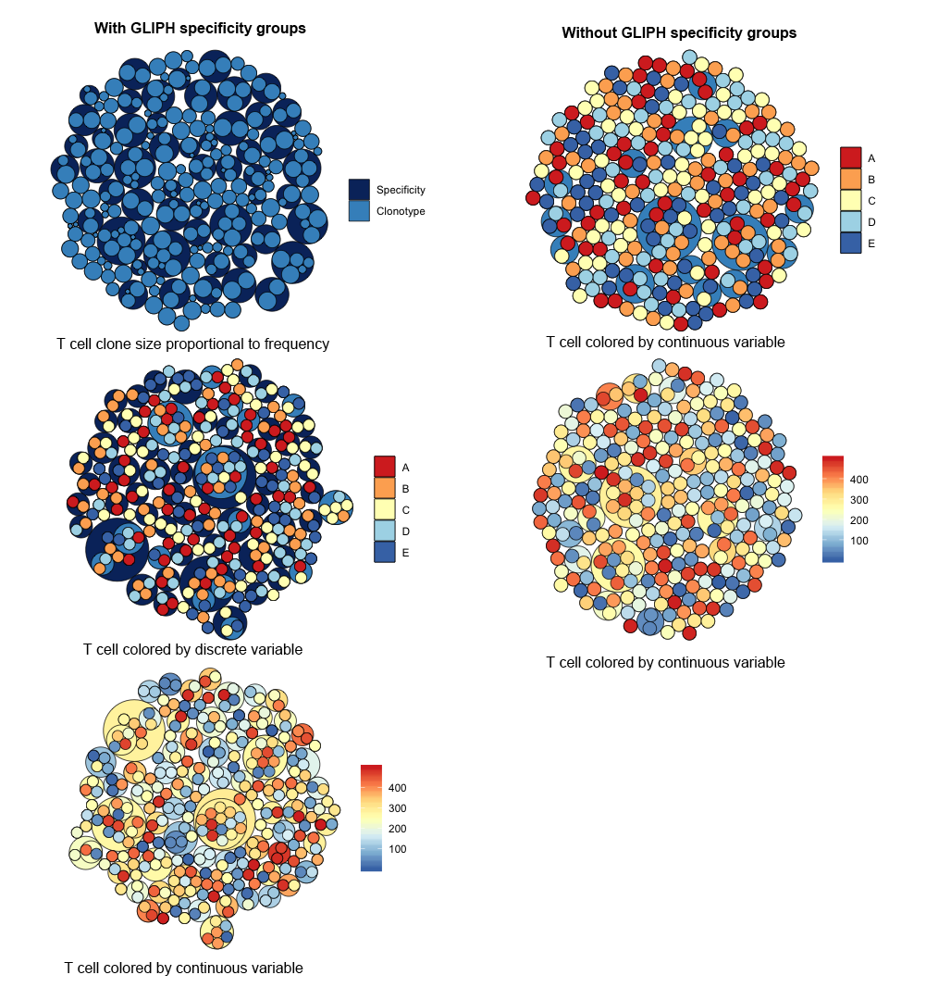

# TCellPack v0.4
TCellPack is an R package used to visualize characteristics of T cell repertoires. It is possible to visualize T cell clonotype diversity and abundance in relation to its antigen specificity and phenotype in a single plot.

### About
T cell packs are circle packing plots representing T cell repertoires. They are able to visualize output data from [GLIPH](https://github.com/immunoengineer/gliph), [Adaptive ImmunoSeq](https://www.adaptivebiotech.com/products-services/immunoseq), and [10X Chromium single cell immune profiling](https://www.10xgenomics.com/solutions/vdj). One can visualize GLIPH only, 10X only, or a combination of GLIPH and 10X or GLIPH and ImmunoSeq. The visualization is not well suited for Adaptive ImmunoSeq data alone and for that I would recommend the `TopSeqPlot` from the [LymphoSeq](http://bioconductor.org/packages/release/bioc/html/LymphoSeq.html) Bioconductor R package.

To plot data from GLIPH, simply provide the path to the convergence-groups.txt output table. Inner circles are represented by the T cell clonotypes and outer circles are presented by specificity groups. Additionally, if the frequency of each T cell clonotype is known (e.g. from Adaptive ImmunoSeq), that may be supplied as a 2 column data frame with column headers "clonotype" and "frequency". This will draw the clonotype circles in proportion to the frequency of the clones. If additional metadata is known about the T cell clone, then in place of "frequency" a "data" column may be provided with discrete data and the T cell cell clonotypes will be colored accordingly.  If additional information is available at the level of an individual T cell (e.g. 10X Chromium single cell immune profiling), that may be supplied as a 3 column data frame with the column headers "clonotype", "cell", and "data". Data may be a discrete or continuous variable. In this case, individual T cell are represented by the smallest circles colored according to their data value.

The fill and line color can be adjusted and the legend may be hidden or displayed. Additionally, labels can be displayed for each cell, data value, clonotype or specificity group. Since TCellPack is based on the [ggraph](https://github.com/thomasp85/ggraph) package, plots can be modified further by adding additional layers.

### Installation instructions
```
install.packages("devtools")
devtools::install_github("davidcoffey/TCellPack")
```

### Basic usage
TCellPack pack comes with 4 example data frames (`gliph.example`, `clonotype.data.example`, `cell.data.continuous.example`, `cell.data.discrete.example`) that are loaded automatically. Below is the code used to create the five shown images.

```
library(TCellPack)

# T cell clone size proportional to frequency with GLIPH specificity groups
PlotTCellPack(gliph = gliph.example, clonotype.data = clonotype.data.example, legend = TRUE)

# T cell colored by discrete variable with GLIPH specificity groups
PlotTCellPack(gliph = gliph.example, cell.data = cell.data.discrete.example, legend = TRUE)

# T cell colored by continuous variable with GLIPH specificity groups
PlotTCellPack(gliph = gliph.example, cell.data = cell.data.continuous.example, legend = TRUE)

# T cell colored by discrete variable without GLIPH specificity groups
PlotTCellPack(cell.data = cell.data.discrete.example, legend = TRUE)

# T cell colored by continuous variable without GLIPH specificity groups
PlotTCellPack(cell.data = cell.data.continuous.example, legend = TRUE)
```


