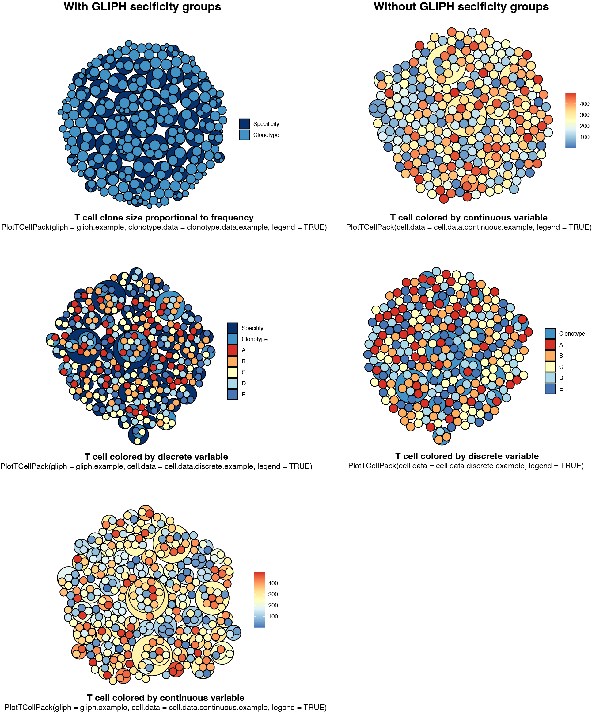

# TCellPack v0.1
TCellPack is a R package used to visualize characteristics of T cell repertoires.  It is possible to visualize T cell clonotype diversity and abundance in relation to its antigen specificity and phenotype in a single plot.

### About
T cell packs are circle packing plots representing T cell repertoires.  They are intended to visualize output data from [GLIPH](https://github.com/immunoengineer/gliph).  A GLIPH (Grouping of Lymphocyte Interactions by Paratope Hotspots) is a clusters of T cell clonotypes that are predicted to bind the same MHC-restricted peptide antigen on the basis of shared sequence motifs within the T cell receptor CDR3 amino acid sequence.

At a minimum, T cell pack requires the path to a convergence-groups.txt output table from the GLIPH pipeline.  Additionally, if the frequency of each T cell clonotype is known (e.g. from Adapative [ImmunoSeq](https://www.adaptivebiotech.com/products-services/immunoseq)), that may be supplied as a 2 column data frame with column headers "clonotype" and "frequency".  This will draw the clonotype circles in proportion to the fequency of the clones.  If additional information is availble at the level of an individual T cell (e.g. 10X [Chromium single cell immune profiling](https://www.10xgenomics.com/solutions/vdj)), that may be supplied as a 3 column data frame with the column headers "clonotype", "cell", and "data".  Data may be a discrete or continuous variable.  Cell circles are then colored according to the data value.

The fill and line color can be adjusted and the legened may be hiddened or displayed.  Additinaly, labeles can be display for each cicle, clonotype or specificity group.  Since TCellPack is based on the [ggraph](https://github.com/thomasp85/ggraph) package, plots can be modified further by adding additional layers.

### Installation instructions
```
install.packages("devtools")
devtools::install_github("davidcoffey/TCellPack")
```

### Basic usage
TCellPack pack comes with 4 example data frames (`gliph.example`, `clonotype.data.example`, `cell.data.continuous.example`, `cell.data.discrete.example`) that are loaded automaticaly.  Below are is the code used to create the three shown images.

```
library(TCellPack)
# T cell clone size proportional to frequency
TCellPack(gliph = "~/Research/Projects/MMRF INE/Shared/10X scRNAseq/Analyses/Data/GLIPH/GLIPH_TCR_Table-convergence-groups.txt", clonotype.data = clonotype.data.example, legend = TRUE)

# T cell colored by continuous variable
TCellPack(gliph = "~/Research/Projects/MMRF INE/Shared/10X scRNAseq/Analyses/Data/GLIPH/GLIPH_TCR_Table-convergence-groups.txt", cell.data = cell.data.continuous.example, legend = TRUE)

# T cell colored by discrete variable
TCellPack(gliph = "~/Research/Projects/MMRF INE/Shared/10X scRNAseq/Analyses/Data/GLIPH/GLIPH_TCR_Table-convergence-groups.txt", cell.data = cell.data.discrete.example, legend = TRUE)
```


